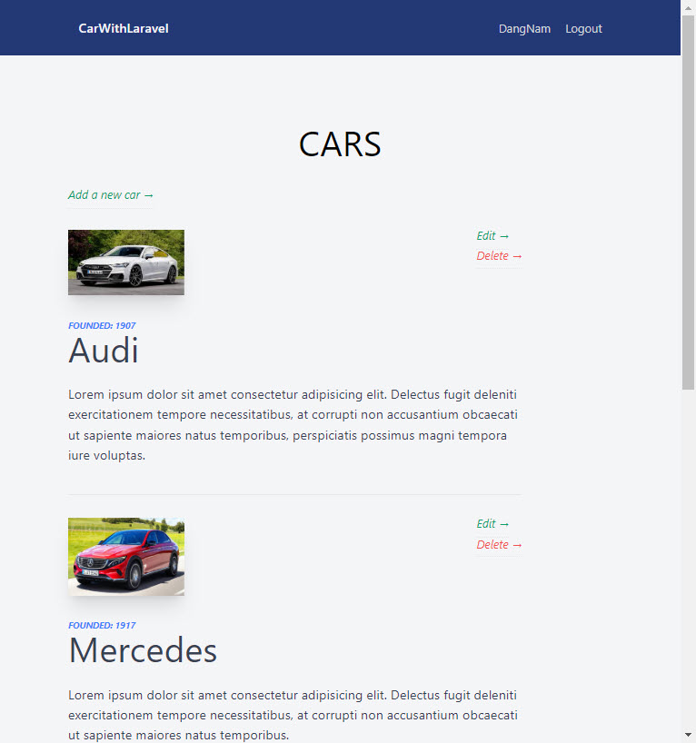
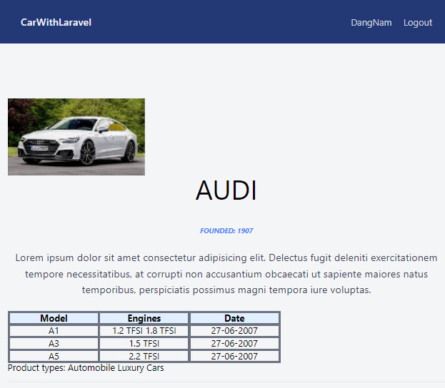
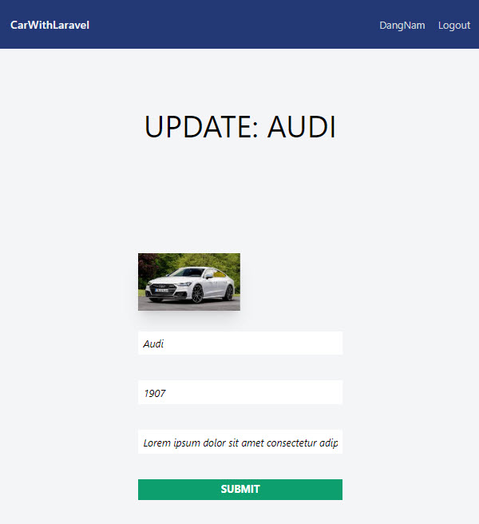

## Description

- Code for functions show, create, edit, delete
- Code to create api to get, post, put data 
- Create and control database with SEED method of Laravel
- Upload image to server
- Understand MVC pattern and control the database of websites
- ...

## Run the SITES

    - Open terminal and run, to open and run site:
    ```php artisan migrate```   (to create database with MySQL)
    ```php artisan db:seed```   (to run seed and insert data to table)
    ```php artisan serve```
    - Open another terminal and run, to run the development environment:
    ```npm run dev```

## Some image of project






